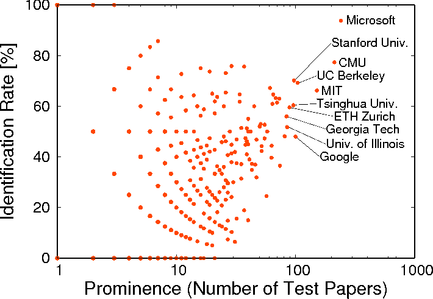

# How ***blind*** are the scientific papers in blind review systems?

"Citations Beyond Self Citations: Identifying Authors, Affiliations, and Nationalities in Scientific Papers," [JCDL 2020 WOSP 2020](https://wosp.core.ac.uk/jcdl2020/)  
[[PDF (Open Access)](https://www.aclweb.org/anthology/2020.wosp-1.2/)]  

  

## Citation
```bibtex
@inproceedings{matsubara2020citations,
   title={Citations Beyond Self Citations: Identifying Authors, Affiliations, and Nationalities in Scientific Papers},
   author={Matsubara, Yoshitomo and Singh, Sameer},
   booktitle={Proceedings of the 8th International Workshop on Mining Scientific Publications},
   year={2020},
   publisher={Association for Computational Linguistics},
   url={https://www.aclweb.org/anthology/2020.wosp-1.2},
   pages={9--20}
}
```

## Requirement
- Java 1.8+  
- commons-cli

## Dataset
- [KDD Cup 2016](https://www.kdd.org/kdd-cup/view/kdd-cup-2016/Data)
